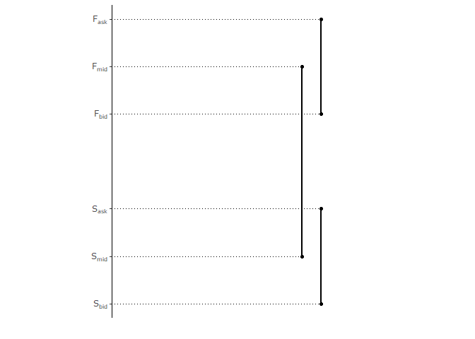
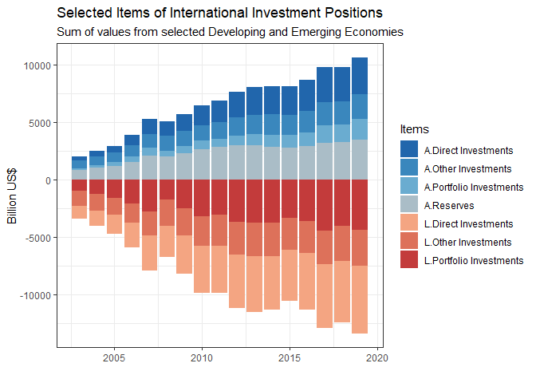
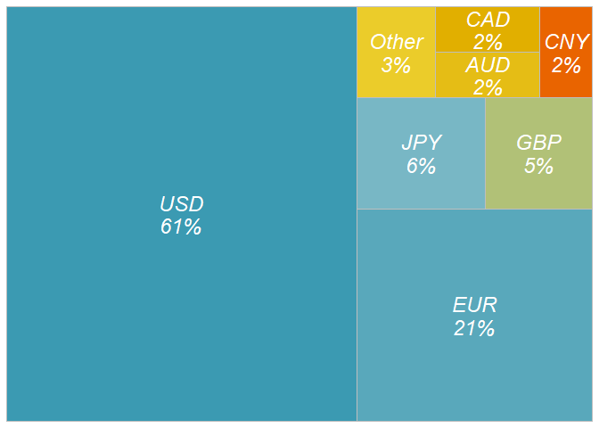
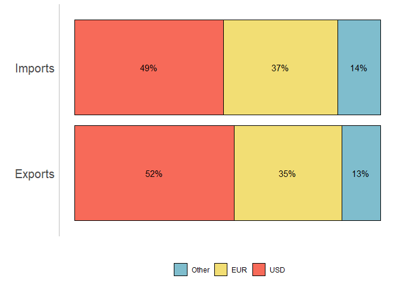
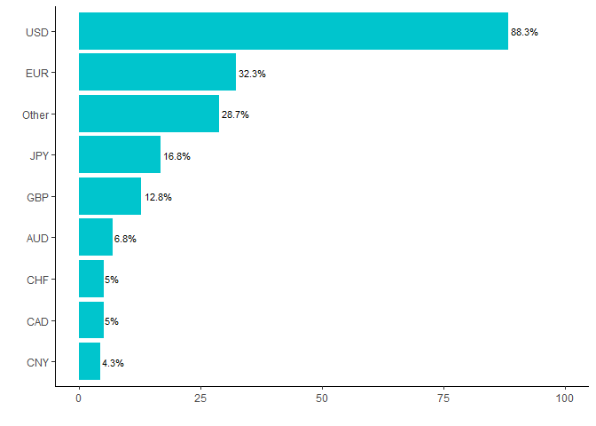
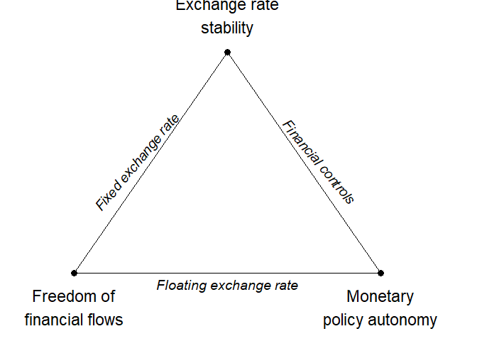

Review chapter
================
João Pedro S. Macalós
1/26/2021

In this notebook, I show how to download the data and replicate the
Figures presented in the chapter “Post-Keynesian theories of exchange
rate dynamics and exchange rate interventions in developing and emerging
economies” of my thesis.

The first step is to load the required packages:

``` r
library(lubridate)   # date tools
library(imfr)        # download data from IMF
library(wbstats)     # download data from WB
library(readxl)      # load excel files
library(janitor)     # tools to clean the dataset
library(extrafont)   # Extrafonts for windows
library(econocharts) # Economics' diagrams
library(Hmisc)       # Expand coordinates into a curved line
library(ggpubr)      # Arrange multiple plots
library(treemapify)  # Plot treemaps
library(wesanderson) # Wesanderson color palette
library(tabulizer)   # Load tables from PDF files
```

    ## Warning in fun(libname, pkgname): Java home setting is INVALID, it will be ignored.
    ## Please do NOT set it unless you want to override system settings.

``` r
library(tidyverse)   # data-wrangling and visualization tools

#font_import()
loadfonts(device = "win")
```

Source helper functions file:

``` r
source("0-functions.R")
```

    ## 
    ## Attaching package: 'rlang'

    ## The following objects are masked from 'package:purrr':
    ## 
    ##     %@%, as_function, flatten, flatten_chr, flatten_dbl, flatten_int,
    ##     flatten_lgl, flatten_raw, invoke, list_along, modify, prepend,
    ##     splice

Define main color palettes:

``` r
mycolors2 <- colorRampPalette(wesanderson::wes_palette("Zissou1", n = 5))(9)
```

# Figure 2.1: Representation of the forward-spot exchange rates’ relationship

Create the lines by setting x and y coordinates:

``` r
bid_ask_fut = tibble(x = c(2.2, 2.2, 2.2), y = c(5.5, 6, 6.5))

bid_ask_spot = tibble(x = c(2.2, 2.2, 2.2), y = c(3.5, 4, 4.5))

bid_ask_f_p = data.frame(y=c(5.5, 6.5), x=c(2.2, 2.2))

bid_ask_s_p = data.frame(y=c(3.5, 4.5), x=c(2.2, 2.2))

spread_average_p = data.frame(y=c(4, 6), x=c(2,2))
```

Plot:

``` r
p1 <- ggplot(mapping = aes(x=x, y=y)) + 
  geom_path(data=spread_average_p, size=1) +
  geom_path(data=bid_ask_fut, size=1) +
  geom_path(data=bid_ask_spot, size=1) +
  geom_point(data=bid_ask_f_p, shape=19) +
  geom_point(data=bid_ask_s_p, shape=19) +
  geom_point(data=spread_average_p, shape=19) +
  geom_segment(data = bid_ask_f_p, 
               aes(x = 0, y = y, xend = x, yend = y), size=0, lty = "dotted") +
  geom_segment(data = bid_ask_s_p, 
               aes(x = 0, y = y, xend = x, yend = y), size=0, lty = "dotted") +
  geom_segment(data = spread_average_p, 
               aes(x = 0, y = y, xend = x, yend = y), size=0, lty = "dotted") +
  coord_equal() +
  theme_classic(base_family = "MS Reference Sans Serif")  +
  scale_y_continuous('',breaks = c(bid_ask_f_p$y, bid_ask_s_p$y, spread_average_p$y), 
                     labels = expression(F[bid], F[ask], S[bid], S[ask], S[mid], F[mid])) +
  scale_x_continuous('',limits=c(0,3), expand=c(0,0)) +
  theme(axis.line.x=element_blank(),
        axis.ticks.x = element_blank(),
        axis.text.x = element_blank())
p1
```

<!-- -->

# Figure 2.2 Effect of capital inflows on foreign exchange markets

Points and intersections:

``` r
x <- c(2, 5, 8)
y <- c(1, 5, 9)
supply1 <- data.frame(Hmisc::bezier(x, y, evaluation = 500))
supply2 <- data.frame(Hmisc::bezier(x+2, y, evaluation = 500))
x <- c(1, 3, 9)
y <- c(9, 3, 1)
demand1 <- data.frame(Hmisc::bezier(x, y, evaluation = 500))
#demand2 <- data.frame(bezier(x+2, y, evaluation = 500))


intersections <- bind_rows(
  econocharts::curve_intersect(supply1, demand1),
  econocharts::curve_intersect(supply2, demand1)
) %>%
  unique()
```

Plots:

``` r
plot1 <- sdplot(supply1, demand1, supply2,
       intersections = intersections,
       labels = c("S1", "D1", "S2"), 
       x.axis = expression(Q[1], Q[2]), 
       y.axis = expression(E[1], E[2])) +
  geom_segment(x = 7, xend = 8, y = 7, yend = 7, size = 1, 
               arrow = arrow(length = unit(.15, "inches")), 
               lineend = "butt", linejoin = "mitre",
               color = "firebrick3") +
  labs(title = "Capital inflows",
       subtitle = "Without interventions")


demand2 <- data.frame(Hmisc::bezier(x+1.2, y+0.05, evaluation = 500))

intersections2 <- bind_rows(
  econocharts::curve_intersect(supply1, demand1),
  econocharts::curve_intersect(supply2, demand1),
  econocharts::curve_intersect(supply2, demand2)
) %>%
  unique()

plot2 <- sdplot(supply1, demand1, supply2, demand2,
       intersections = intersections2,
       labels = c("S1", "D1", "S2", "D2"), 
       x.axis = expression(Q[1], Q[2], Q[3]), 
       y.axis = expression(E[1], E[2], E[3])) +
  geom_segment(x = 1.9, xend = 2.8, y = 7, yend = 7, size = 1, 
               arrow = arrow(length = unit(.07, "inches")), 
               lineend = "butt", linejoin = "mitre",
               color = "dodgerblue3") +
  labs(title = "Capital inflows",
       subtitle = "With interventions")


ggpubr::ggarrange(plot1, plot2, ncol = 2)
```

<!-- -->

# Figure 2.3: Selected items of international investment positions of developing and emerging economies

Load list of DEEs countries:

``` r
dees_list <- c("AR", "BR", "CL", "CO", "CZ", "EG", "HU", "IN", "ID", "IL", "KR", "MY", "MX", 
               "MA", "NG", "PK", "PE", "PH", "PL", "RO", "RU", "ZA", "TH", "TR", "UA")
```

1.  Codes of each series:

``` r
assets <- paste0(c("IAFR", "IAD", "IAP", "IAO", "IARFR"), "_BP6_USD")
liabilities <- paste0(c("ILFR", "ILD", "ILP", "ILOFR"), "_BP6_USD")
```

1.  Download:

``` r
# Uncomment to download:

# assets_data <- map(assets, ~imf_data("BOP", .x, country = dees_list, start = 2003, end = 2019, freq = "A"))
# liabilities_data <- map(liabilities, ~imf_data("BOP", .x, country = dees_list, start = 2003, end = 2019, freq = "A"))

# assets_data1 <- multi_join(assets_data) %>% mutate(year = as.numeric(year))
# liabs_data1 <- multi_join(liabilities_data) %>% mutate(year = as.numeric(year))

assets_data1 <- read_csv("Data/assets_data.csv")
```

    ## 
    ## -- Column specification --------------------------------------------------------
    ## cols(
    ##   iso2c = col_character(),
    ##   year = col_double(),
    ##   IAFR_BP6_USD = col_double(),
    ##   IAD_BP6_USD = col_double(),
    ##   IAP_BP6_USD = col_double(),
    ##   IAO_BP6_USD = col_double(),
    ##   IARFR_BP6_USD = col_double()
    ## )

``` r
liabs_data1 <- read_csv("Data/liabilities_data.csv")
```

    ## 
    ## -- Column specification --------------------------------------------------------
    ## cols(
    ##   iso2c = col_character(),
    ##   year = col_double(),
    ##   ILFR_BP6_USD = col_double(),
    ##   ILD_BP6_USD = col_double(),
    ##   ILP_BP6_USD = col_double(),
    ##   ILOFR_BP6_USD = col_double()
    ## )

1.  Dictionary to have proper column names:

``` r
dictionary <- tibble(
  name = c(assets, liabilities),
  newname = c("Assets", "A.Direct Investments", "A.Portfolio Investments", "A.Other Investments", "A.Reserves",
            "Liabilities", "L.Direct Investments", "L.Portfolio Investments", "L.Other Investments")
)
```

Join data:

``` r
data_p1 <- full_join(assets_data1, liabs_data1) %>% 
  as_tibble() %>%
  mutate(year = as.numeric(year)) 

data_p1 <- data_p1 %>%
  mutate(across(contains("L"), ~ .x * -1)) %>%
  group_by(year) %>%
  summarize(across(-iso2c, ~sum(.x))) %>%
  select(-2, -7) %>%
  pivot_longer(cols = -year) %>%
  left_join(dictionary) %>%
  mutate(value = value/10^3)
```

Create a palette of colors for the plot:

``` r
pal1 <- colorRampPalette(RColorBrewer::brewer.pal(10, "RdBu")[c(9, 8, 7, 4, 3, 2, 1)])
```

Plot:

``` r
ggplot(data_p1, aes(x = year, y = value)) +
  geom_col(aes(fill = newname)) +
  theme_bw() +
  scale_fill_manual(
    "Items",
    values =  pal1(length(unique(dictionary$newname)))) +
  labs(title = "Selected Items of International Investment Positions",
       subtitle = "Sum of values from selected Developing and Emerging Economies",
       x = "", y = "Billion US$")
```

<!-- -->

# Figure 2.4: Currency composition of allocated international reserves, 2019

This figure requires data from the
[COFER](https://data.imf.org/?sk=E6A5F467-C14B-4AA8-9F6D-5A09EC4E62A4)
database available at the IMF. I downloaded the data and saved it into
`.csv` format.

1.  Load the data:

``` r
cofer <- read_csv("Data/imf_cofer.csv")
```

    ## Warning: Missing column names filled in: 'X118' [118]

    ## 
    ## -- Column specification --------------------------------------------------------
    ## cols(
    ##   .default = col_double(),
    ##   `Country Name` = col_character(),
    ##   `Country Code` = col_character(),
    ##   `Indicator Name` = col_character(),
    ##   `Indicator Code` = col_character(),
    ##   Attribute = col_character(),
    ##   X118 = col_logical()
    ## )
    ## i Use `spec()` for the full column specifications.

1.  Clean:

``` r
cofer2 <- cofer %>%
  clean_names() %>%
  select(-country_code, -indicator_code, -attribute) %>%
  pivot_longer(cols = -c("country_name", "indicator_name")) %>%
  mutate(date = as.numeric(str_remove_all(name, "x"))) %>%
  drop_na() %>%
  filter(country_name == "World",
         str_detect(indicator_name, "Shares"),
         indicator_name != "Shares of Allocated Reserves, Percent",
         indicator_name != "Shares of Unallocated Reserves, Percent") %>%
  mutate(indicator_name = str_remove_all(indicator_name,
                                         "Shares of Allocated Reserves, Shares of |, Percent")) %>%
  select(-name)
```

    ## Warning: Problem with `mutate()` input `date`.
    ## i NAs introduced by coercion
    ## i Input `date` is `as.numeric(str_remove_all(name, "x"))`.

    ## Warning in mask$eval_all_mutate(dots[[i]]): NAs introduced by coercion

``` r
cofer3 <- cofer2 %>%
  filter(date %in% 2012:2020) %>%
  mutate(value = value/100) %>%
  mutate(indicator_name = case_when(
    indicator_name == "euro" ~ "EUR",
    indicator_name == "other currencies" ~ "Other",
    indicator_name == "pounds sterling" ~ "GBP",
    str_detect(indicator_name, "Japanese") ~ "JPY",
    str_detect(indicator_name, "Swiss") ~ "CHF",
    str_detect(indicator_name, "Chinese") ~ "CNY",
    str_detect(indicator_name, "U.S") ~ "USD",
    str_detect(indicator_name, "Australian") ~ "AUD",
    str_detect(indicator_name, "Canadian") ~ "CAD",
    TRUE ~ indicator_name
  )) 
```

``` r
p2 <- cofer3 %>%
  mutate(value = 100*value) %>%
  filter(date == 2019) %>%
  mutate(value2 = round(value, 0)) %>%
  mutate(name2 = paste0(indicator_name, "\n", value2, "%")) %>%
  mutate(name2 = fct_reorder(name2, value2, mean, .desc = TRUE)) %>%
  ggplot(aes(area = value2, fill = name2, label = name2)) +
  treemapify::geom_treemap() +
  treemapify::geom_treemap_text(fontface = "italic", colour = "white", place = "centre",
                    grow = FALSE) +
  scale_fill_manual("", values = mycolors2) +
  theme(legend.position = "none")

p2
```

<!-- -->

# Figure 2.5: Currency composition of world’s imports and exports invoicing, 2018

The dataset containing information about trade invoicing was collected
by @boz2020invoice and is available at the [IMF’s
website](https://www.imf.org/en/Publications/WP/Issues/2020/07/17/Patterns-in-Invoicing-Currency-in-Global-Trade-49574).

I downloaded the data and extracted the excel file in my working
directory. Let’s load it to R.

``` r
invoice_data <-read_excel("Data/all countries.xlsx", sheet = 2)
```

``` r
glimpse(invoice_data)
```

    ## Rows: 3,007
    ## Columns: 16
    ## $ Country                    <chr> "UEMOA", "UEMOA", "UEMOA", "UEMOA", "UEM...
    ## $ ISO3C                      <chr> NA, NA, NA, NA, NA, NA, NA, NA, NA, NA, ...
    ## $ imfcode                    <dbl> NA, NA, NA, NA, NA, NA, NA, NA, NA, NA, ...
    ## $ year                       <dbl> 1990, 1991, 1992, 1993, 1994, 1995, 1996...
    ## $ `Export USD`               <dbl> NA, NA, NA, NA, NA, NA, NA, NA, NA, NA, ...
    ## $ `Export EUR`               <dbl> NA, NA, NA, NA, NA, NA, NA, NA, NA, NA, ...
    ## $ `Export Home`              <dbl> NA, NA, NA, NA, NA, NA, NA, NA, NA, NA, ...
    ## $ `Export Other`             <dbl> NA, NA, NA, NA, NA, NA, NA, NA, NA, NA, ...
    ## $ `Export Unclassified`      <dbl> NA, NA, NA, NA, NA, NA, NA, NA, NA, NA, ...
    ## $ `Export Other_Excl_USDEUR` <dbl> NA, NA, NA, NA, NA, NA, NA, NA, NA, NA, ...
    ## $ `Import USD`               <dbl> NA, NA, NA, NA, NA, NA, NA, NA, NA, NA, ...
    ## $ `Import EUR`               <dbl> NA, NA, NA, NA, NA, NA, NA, NA, NA, NA, ...
    ## $ `Import Home`              <dbl> NA, NA, NA, NA, NA, NA, NA, NA, NA, NA, ...
    ## $ `Import Other`             <dbl> NA, NA, NA, NA, NA, NA, NA, NA, NA, NA, ...
    ## $ `Import Unclassified`      <dbl> NA, NA, NA, NA, NA, NA, NA, NA, NA, NA, ...
    ## $ `Import Other_Excl_USDEUR` <dbl> NA, NA, NA, NA, NA, NA, NA, NA, NA, NA, ...

This dataset has information about trade invoicing data from 102
countries from 1990 until 2018, separated by exports and imports. Let’s
start cleaning by dropping NAs and renaming the columns:

``` r
invoice_data1 <- invoice_data %>%
  clean_names() %>%
  drop_na()
```

Separate the dataset into two tibbles, one containing exports data, and
another containing imports data:

``` r
invoice_x <- invoice_data1 %>%
  select(1, 2, 4, contains("export"))

invoice_m <- invoice_data1 %>%
  select(1, 2, 4, contains("import"))
```

Clean exports tibble for ploting:

``` r
invoice_x2 <- invoice_x %>%
  drop_na() %>%
  filter(year %in% 2011:2018) %>%                                              # 3
  group_by(year) %>%                                                    # 4
  summarize(across(contains("export"), ~sum(.x))) %>%
  select(year, USD = export_usd, EUR = export_eur, Other = export_other_excl_usdeur) %>%
  mutate(total = USD + EUR + Other) %>%
  mutate(across(c("USD", "EUR", "Other"), ~.x / total)) %>%
  select(-total)
```

    ## `summarise()` ungrouping output (override with `.groups` argument)

``` r
invoice_x3 <- invoice_x2 %>%
  pivot_longer(cols = -year) %>%
  filter(year == 2018) %>%
  rename(Exports = value)
```

Clean imports tibble for ploting:

``` r
invoice_m2 <- invoice_m %>%
  drop_na() %>%
  filter(year %in% 2011:2018) %>%                                              # 3
  group_by(year) %>%                                                    # 4
  summarize(across(contains("import"), ~sum(.x))) %>%
  select(year, USD = import_usd, EUR = import_eur, Other = import_other_excl_usdeur) %>%
  mutate(total = USD + EUR + Other) %>%
  mutate(across(c("USD", "EUR", "Other"), ~.x / total)) %>%
  select(-total)
```

    ## `summarise()` ungrouping output (override with `.groups` argument)

``` r
invoice_m3 <- invoice_m2 %>%
  pivot_longer(cols = -year) %>%
 # mutate(value = cumsum(value) - 0.5*value) %>%
  filter(year == 2018) %>%
  rename(Imports = value)
```

Plot:

``` r
p1 <- invoice_x3 %>%
  left_join(invoice_m3 %>% arrange(desc(Imports)), by = c("year", "name")) %>%
  pivot_longer(cols = c("Exports", "Imports"), names_to = "trade") %>%
  mutate(pct = round(value * 100, 0)) %>%
  group_by(trade) %>%
  arrange(desc(value)) %>%
  mutate(pos = cumsum(value) - 0.5*value,
         name = fct_reorder(name, value, .desc = FALSE)) %>%
  ggplot(aes(x = trade, y = value, fill = name)) +
  geom_col(position = "stack", color = "black", alpha = .65) +
  coord_flip() +
  geom_text(aes(y = pos, label = paste0(pct, "%"))) +
  scale_fill_manual("", values = wesanderson::wes_palette("Zissou1", 3, type = "continuous")) +
  theme_bw() +
  theme(legend.position = "bottom",
        panel.grid = element_blank(),
        axis.text.x = element_blank(),
        axis.text.y = element_text(size = 15),
        #axis.text.y = element_blank(),
        axis.ticks.x = element_blank(),
        axis.ticks.y = element_blank(),
        axis.line.y.left = element_line(color = "gray"),
        panel.border = element_blank()) +
  labs(x = "", y = "")

p1
```

<!-- -->

# Figure 2.6: Currency denomination of global banks’ cross-border claims, 2020

The data to create this plot was downloaded from the
[BIS](https://stats.bis.org/statx/srs/table/a1?m=S) webpage:

``` r
bis_lbs <- read_csv("Data/table-a1-bis.csv")
```

    ## 
    ## -- Column specification --------------------------------------------------------
    ## cols(
    ##   .default = col_character(),
    ##   `30/06/2012` = col_double(),
    ##   `30/09/2012` = col_double(),
    ##   `31/12/2012` = col_double(),
    ##   `31/03/2013` = col_double(),
    ##   `30/06/2013` = col_double(),
    ##   `30/09/2013` = col_double(),
    ##   `31/12/2013` = col_double(),
    ##   `31/03/2014` = col_double(),
    ##   `30/06/2014` = col_double(),
    ##   `30/06/2015` = col_double(),
    ##   `30/09/2015` = col_double(),
    ##   `31/12/2015` = col_double(),
    ##   `31/03/2016` = col_double(),
    ##   `30/06/2016` = col_double(),
    ##   `30/09/2016` = col_double(),
    ##   `31/12/2016` = col_double(),
    ##   `31/03/2017` = col_double(),
    ##   `30/06/2017` = col_double(),
    ##   `31/12/2017` = col_double(),
    ##   `31/03/2018` = col_double()
    ##   # ... with 9 more columns
    ## )
    ## i Use `spec()` for the full column specifications.

Clean:

``` r
bis_lbs2 <- bis_lbs %>%
  clean_names() %>%
  filter(str_detect(currency_denomination, "EUR|CHF|USD|JPY|GBP")) %>%
  filter(str_detect(balance_sheet_position, "Total claims")) %>%
  filter(counterparty_sector == "A:All sectors") %>%
  select(5, contains("x")) %>%
  #slice(-1) %>%
  mutate(across(-currency_denomination, ~as.numeric(.x))) %>%
  pivot_longer(cols = -currency_denomination) %>%
  mutate(name = str_remove_all(name, "x"),
         date = dmy(name),
         name = substring(currency_denomination, 1, 3)) %>%
  select(name, date, value)

bis_lb3 <- bis_lbs2 %>%
  group_by(year = year(date), name) %>%
  summarize(value = mean(value)) %>%
  filter(year > 2010) %>%
  group_by(year) %>%
  mutate(total = sum(value),
         share = value/total) %>%
  mutate(name = if_else(str_detect(name, "TO"), "Other", name))
```

    ## `summarise()` regrouping output by 'year' (override with `.groups` argument)

Plot:

``` r
p4 <- bis_lb3 %>%
  filter(year == 2020) %>%
  mutate(share2 = round(100*share, 0)) %>%
  mutate(name2 = paste0(name, "\n", share2, "%")) %>%
  ggplot(aes(area = share, fill = name2, label = name2)) +
  treemapify::geom_treemap() +
  treemapify::geom_treemap_text(fontface = "italic", colour = "white", place = "centre",
                    grow = FALSE) +
  #scale_fill_brewer("", palette = "RdBu") +
  scale_fill_manual("", values = rev(wes_palette("Zissou1", 7, "continuous"))) +
  theme(legend.position = "none")

p4
```

<!-- -->

# Figure 2.7: Currency distribution of OTC foreign exchange turnover, 2019

Data from the [BIS](https://www.bis.org/statistics/rpfx19_fx.htm) was
used to make this figure.

Uncomment the following code to find the position of the table in the
PDF file:

``` r
# Uncomment to find

# tabulizer::locate_areas("FX TURNOVER/rpfx19_fx.pdf", pages = 12)
```

Extract the relevant table:

``` r
fx_turnover <- extract_tables("Data/rpfx19_fx.pdf",
             output = "data.frame",
             pages = c(12), 
             area = list(c(148, 62, 573, 452)),
             guess = FALSE,
             method = "stream"
             )
```

Transform into a tibble:

``` r
fx_turnover2 <- as_tibble(fx_turnover[[1]])
```

Clean:

``` r
fx_turnover3 <- fx_turnover2 %>%
  select(X, contains("Share")) %>%
  mutate(across(-X, ~as.numeric(.x))) %>%
  set_names(c("name", as.character(c(2004, 2007, 2010, 2013, 2016, 2019)))) %>%
  pivot_longer(cols = -name, names_to = "year")
```

    ## Warning: Problem with `mutate()` input `..1`.
    ## i NAs introduced by coercion
    ## i Input `..1` is `across(-X, ~as.numeric(.x))`.

    ## Warning in fn(col, ...): NAs introduced by coercion

    ## Warning: Problem with `mutate()` input `..1`.
    ## i NAs introduced by coercion
    ## i Input `..1` is `across(-X, ~as.numeric(.x))`.

    ## Warning in fn(col, ...): NAs introduced by coercion

    ## Warning: Problem with `mutate()` input `..1`.
    ## i NAs introduced by coercion
    ## i Input `..1` is `across(-X, ~as.numeric(.x))`.

    ## Warning in fn(col, ...): NAs introduced by coercion

    ## Warning: Problem with `mutate()` input `..1`.
    ## i NAs introduced by coercion
    ## i Input `..1` is `across(-X, ~as.numeric(.x))`.

    ## Warning in fn(col, ...): NAs introduced by coercion

    ## Warning: Problem with `mutate()` input `..1`.
    ## i NAs introduced by coercion
    ## i Input `..1` is `across(-X, ~as.numeric(.x))`.

    ## Warning in fn(col, ...): NAs introduced by coercion

``` r
fx_turnover4 <- fx_turnover3 %>%
  mutate(name = str_remove_all(name, "[:digit:]")) %>%
  mutate(cat = case_when(
    name %in% c("USD", "EUR", "JPY", "GBP", "AUD", "CAD", "CHF", "CNY") ~ name,
    TRUE ~ "Other"
  )) %>%
  group_by(year, cat) %>%
  summarize(value = sum(value, na.rm = TRUE)) %>%
  mutate(year = as.numeric(year))
```

Plot:

``` r
fx_turnover4 %>%
  filter(year == 2019) %>%
  mutate(value2 = round(value, 0)) %>%
  mutate(name2 = paste0(value, "%")) %>%
  mutate(name2 = fct_reorder(name2, value2, mean, .desc = TRUE),
         name = fct_reorder(cat, value2, .desc = FALSE)) %>%
  ggplot(aes(x = name, y = value)) +
  geom_col(fill = "turquoise3") +
  geom_text(size = 3, aes(label = name2), hjust= -0.1) +
  scale_y_continuous(limits = c(0, 100)) +
  coord_flip() +
  labs(x = "", y = "") +
  theme_classic() +
  theme(legend.position = "none")
```

<!-- -->

# Figure 2.8: Monetary hierarchy

This figure was entirely created “by hand”. It means that I had to give
values to each of the points.

``` r
currencies <- c("US", "EU", "UK", "JP", "KR", "BR", "TR", "IN", "AR", "MX", "TH", "ZA", "VE", "ZW")
assets <- c("GB", "BD", "MM", "CP", "ST")
tba <- tibble(assets = assets, assets_value = c(5, 4.5, 3, 2, 1))
tbc <- tibble(currencies = currencies,
              currencies_value = c(1, 2, 3, 3, 4, 5, 5, 5, 5, 5, 5, 5, 8, 8),
              group = c(1, 2, 2, 2, 2.5, 3, 3, 3, 3, 3, 3, 3, 4, 4))

tb1 <- expand_grid(currencies, assets)

tb2 <- tb1 %>%
  left_join(tba) %>%
  left_join(tbc) %>%
  mutate(label = paste(currencies, assets, sep = "-"))
```

    ## Joining, by = "assets"

    ## Joining, by = "currencies"

``` r
tb3 <- tb2 %>%
  mutate(
    assets_value = case_when(
      assets == "GB" ~ runif(1, 5, 5.5),
      assets == "BD" ~ runif(1, 4.5, 5),
      assets == "MM" ~ runif(1, 3, 4.5),
      assets == "CP" ~ runif(1, 2, 3),
      TRUE ~ runif(1, 1, 2)),
    currencies_value = case_when(
      group == 1 ~ runif(1, 1, 2),
      group == 2 ~ runif(1, 2, 3),
      group == 2.5 ~ runif(1, 3, 4),
      group == 3 ~ runif(1, 4, 7),
      TRUE ~ runif(1, 7, 8))
    )

tb3 <- tb2 %>%
  mutate(
    al = case_when(
      assets == "GB" ~ 4.6,
      assets == "BD" ~ 4.1,
      assets == "MM" ~ 3.1,
      assets == "CP" ~ 2.1,
      TRUE ~ 1.1),
    ar = case_when(
      assets == "GB" ~ 4.9,
      assets == "BD" ~ 4.4,
      assets == "MM" ~ 3.9,
      assets == "CP" ~ 2.9,
      TRUE ~ 1.9),
    cl = case_when(
      group == 1 ~ 1.1,
      group == 2 ~ 2.1,
      group == 2.5 ~ 3.7,
      group == 3 ~ 4.1,
      TRUE ~ 7.2),
    cr = case_when(
      group == 1 ~ 1.6,
      group == 2 ~ 2.9,
      group == 2.5 ~ 4.5,
      group == 3 ~ 6.9,
      TRUE ~ 7.9)
    ) %>%
  mutate(assets_value2 = map2_dbl(al, ar, ~runif(1, .x, .y)),
         currencies_value2 = map2_dbl(cl, cr, ~runif(1, .x, .y)))
```

``` r
tb4 <- tb3 %>%
  filter(!c(label %in% paste0("VE-", c("MM", "CP", "ST")))) %>%
  filter(!c(label %in% paste0("ZW-", c("MM", "CP", "ST"))))
```

``` r
set.seed(777)
sample_n(tb4, 25) %>%
  mutate(currencies_value2 = if_else(label == "US-BD", 1.05, currencies_value2),
         currencies_value2 = if_else(label == "US-GB", 1, currencies_value2),
         currencies_value2 = if_else(label == "JP-GB", 2.75, currencies_value2)) %>%
  ggplot(aes(x = currencies_value2, y = assets_value2, label = label)) +
  geom_point(size = 1) +
  #geom_rect(alpha = 0.5, xmax = 1.5, xmin = 0, ymax = 6, ymin = 4, fill = "green") +
  annotate("rect", xmax = 1.75, xmin = -Inf, ymax = Inf, ymin = 4, alpha=0.5, fill=wes_palette("Zissou1")[1]) +
  annotate("rect", xmax = 3.5, xmin = 1.75, ymax = Inf, ymin = 4, alpha=0.2, fill=wes_palette("Zissou1")[1]) +
  annotate("rect", xmax = Inf, xmin = 7.2, ymax = Inf, ymin = -Inf, alpha=0.6, fill=wes_palette("Zissou1")[5]) +
  annotate("rect", xmax = 7.2, xmin = 3.5, ymax = Inf, ymin = 4, alpha=0.2, fill=wes_palette("Zissou1")[3]) +
  annotate("rect", xmax = 3.5, xmin = -Inf, ymax = 4, ymin = -Inf, alpha=0.2, fill=wes_palette("Zissou1")[3]) +
  #annotate("rect", xmax = 3.5, xmin = -Inf, ymax = 4, ymin = -Inf, alpha=0.2, fill="yellow") +
  annotate("rect", xmax = 7.2, xmin = 3.5, ymax = 4, ymin = -Inf, alpha=0.6, fill=wes_palette("Zissou1")[4]) +
  geom_hline(yintercept = 4, color = "lightgray") +
  geom_vline(xintercept = 3.5, color = "lightgray") +
  geom_vline(xintercept = 7.2, color = "lightgray") +
  #geom_jitter(width = 0.2, height = 0.2) +
  ggrepel::geom_text_repel(aes(label=label), fontface = "italic") +
  theme(axis.text.x = element_blank(),
        axis.text.y = element_blank(),
        axis.ticks.x = element_blank(),
        axis.ticks.y = element_blank(),
        panel.background = element_rect(fill = "white"),
        panel.border = element_rect(color = "black", fill = NA),
        legend.position = "none",
        legend.title = element_blank(),
        panel.grid.major = element_blank(), 
        panel.grid.minor = element_blank()) +
  labs(x = "", y = "") +
  annotate("segment", x = 8, xend = 1, y = 6, yend = 6, colour = wes_palette("Zissou1")[1], size=3, alpha=0.6, arrow=arrow()) +
  annotate("text", x = 4, y = 6.5, colour = "black", size=8, alpha=1, label = "Currency liquidity") +
  annotate("text", x = 1.1, y = 5.5, colour = "black", size=3, alpha=1, label = "Hegemonic\ncurrency", fontface = "italic") +
  annotate("text", x = 2.45, y = 5.5, colour = "black", size=3, alpha=1, label = "Central\ncurrencies", fontface = "italic") +
  annotate("text", x = 5.15, y = 5.5, colour = "black", size=3, alpha=1, label = "Peripheral\ncurrencies", fontface = "italic") +
  annotate("text", x = 7.75, y = 5.5, colour = "black", size=3, alpha=1, label = "Hyperinflationary\ncurrencies", fontface = "italic") +
  annotate("segment", x = -0.5, xend = -0.5, y = 1, yend = 5, colour = wes_palette("Zissou1")[1], size=3, alpha=0.6, arrow=arrow()) +
  annotate("text", x = 0.15, y = 5, colour = "black", size=3, alpha=1, label = "Government\nbills", fontface = "italic") +
  annotate("text", x = 0.2, y = 4.25, colour = "black", size=3, alpha=1, label = "Bank\ndeposits", fontface = "italic") +
  annotate("text", x = 0.1, y = 3.25, colour = "black", size=3, alpha=1, label = "Money market\nfunds", fontface = "italic") +
  annotate("text", x = 0.15, y = 2.25, colour = "black", size=3, alpha=1, label = "Commercial\npapers", fontface = "italic") +
  annotate("text", x = 0.2, y = 1.25, colour = "black", size=3, alpha=1, label = "Stocks", fontface = "italic") +
  annotate("text", x = -1, y = 3, angle = 90, colour = "black", size=8, alpha=1, label = "Monetary liquidity") +
  theme(plot.margin = unit(c(6, 1, 1, 6), "lines")) +
  coord_cartesian(ylim = c(1, 5), xlim = c(1, 8), clip = "off")
```

<!-- -->

# Figure 2.9: Effect of capital inflows followed by capital outflows in foreign exchange markets

Points and intersections of the “inflows” plot:

``` r
x <- c(2, 5, 8)
y <- c(1, 5, 9)
oferta1 <- data.frame(Hmisc::bezier(x, y, evaluation = 500))
oferta2 <- data.frame(Hmisc::bezier(x+2, y, evaluation = 500))

x <- c(1, 3, 9)
y <- c(9, 3, 1)
demand1 <- data.frame(Hmisc::bezier(x, y, evaluation = 500))
demand2 <- data.frame(Hmisc::bezier(x+2, y, evaluation = 500))

intersections <- bind_rows(
  econocharts::curve_intersect(oferta1, demand1),
  econocharts::curve_intersect(oferta2, demand1)
) %>%
  unique()
```

``` r
### FROM ANPEC FILE
p1 <- sdplot(oferta1, demand1, oferta2,
             intersections = intersections,
             labels = c("S1", "D1", "S2"), 
             x.axis = expression(Q[1], Q[2]), 
             y.axis = expression(E[1], E[2])) +
  geom_segment(x = 7, xend = 8, y = 7, yend = 7, size = 1.5, 
               arrow = arrow(length = unit(.15, "inches")), 
               lineend = "butt", linejoin = "mitre",
               color = "firebrick3") +
  labs(title = "Capital inflows")
```

``` r
x <- c(2, 4, 11)
y <- c(9, 3, 1)
demand2 <- data.frame(Hmisc::bezier(x, y, evaluation = 500))


intersections2 <- bind_rows(
  econocharts::curve_intersect(oferta2, demand1),
  econocharts::curve_intersect(oferta1, demand2)
) %>%
  unique()
```

``` r
p2 <- sdplot(oferta2, demand1, oferta1, demand2,
             intersections = intersections2,
             labels = c("S1", "D1", "S2", "D2"),
             x.axis = expression(Q[2], Q[3]), 
             y.axis = expression(E[2], E[3])) +
  geom_segment(x = 8, xend = 7, y = 7, yend = 7, 
               size = 1.5, 
               arrow = arrow(length = unit(.15, "inches")), 
               lineend = "butt", linejoin = "mitre",
               color = "firebrick3") +
  geom_segment(x = 7.1, xend = 7.9, y = 2, yend = 2, size = 1.5, 
               arrow = arrow(length = unit(.15, "inches")), lineend = "butt", linejoin = "mitre",
               color = "dodgerblue3") +
  labs(title = "Capital outflows")
```

``` r
ggpubr::ggarrange(p1, p2, ncol = 2)
```

<!-- -->

# Figure 2.10: Monetary trilemma

``` r
trilemma <- tibble(
  x = c(1, 5, 9),
  y = c(1, sqrt(48), 1),
  z = c(1, 1, 1)
)

trilemma %>%
  ggplot(aes(x = x, y = y)) +
  geom_point(size = 3) +
  geom_line() +
  geom_line(aes(y = z)) +
  theme(axis.text.x = element_blank(),
        axis.text.y = element_blank(),
        axis.ticks.x = element_blank(),
        axis.ticks.y = element_blank(),
        panel.background = element_rect(fill = "white"),
        #panel.border = element_rect(color = "black", fill = NA),
        legend.position = "none",
        legend.title = element_blank(),
        panel.grid.major = element_blank(), 
        panel.grid.minor = element_blank(),
        plot.margin = unit(c(3, 3, 3, 3), "lines")) +
  labs(x = "", y = "") +
  coord_cartesian(ylim = c(1, sqrt(48)), xlim = c(1, 10), clip = "off") +
  annotate("text", x = 5, y = sqrt(48) + 1, colour = "black", size=6, alpha=1, label = "Exchange rate\nstability") +
  annotate("text", x = 1, y = 0.1, colour = "black", size=6, alpha=1, label = "Freedom of\nfinancial flows") +
  annotate("text", x = 9, y = 0.1, colour = "black", size=6, alpha=1, label = "Monetary\npolicy autonomy") +
  annotate("text", x = 2.6, y = 4, angle = 50, colour = "black", size=5, alpha=1, label = "Fixed exchange rate", fontface = "italic") +
  annotate("text", x = 7.4, y = 4, angle = -50, colour = "black", size=5, alpha=1, label = "Financial controls", fontface = "italic") +
  annotate("text", x = 5, y = 0.7, colour = "black", size=5, alpha=1, label = "Floating exchange rate", fontface = "italic")
```

<!-- -->

# Figure 2.11: Evolution of world’s international reserves:

This data was collected from the World Bank API through the `wbstats`
package. Uncomment the first line to download it.

``` r
# wb_reserves <- wbstats::wb_data(indicator='FI.RES.XGLD.CD', mrv=20)

wb_reserves <- read_csv("Data/wb_reserves.csv")
```

    ## 
    ## -- Column specification --------------------------------------------------------
    ## cols(
    ##   iso2c = col_character(),
    ##   iso3c = col_character(),
    ##   country = col_character(),
    ##   date = col_double(),
    ##   FI.RES.XGLD.CD = col_double(),
    ##   unit = col_logical(),
    ##   obs_status = col_logical(),
    ##   footnote = col_logical(),
    ##   last_updated = col_date(format = "")
    ## )

Clean and separate into groups:

``` r
dees_reserves <- wb_reserves %>%
  filter(iso2c %in% dees_list)

china_reserves <- wb_reserves %>%
  filter(iso2c == "CN")

jpsw_reserves <- wb_reserves %>%
  filter(iso2c %in% c("JP", "CH"))

other_reserves <- wb_reserves %>%
  filter(!(iso2c %in% c(dees_list, "CN", "JP", "CH")))

dees_res2 <- dees_reserves %>%
  group_by(date) %>%
  summarize(dees = sum(FI.RES.XGLD.CD, na.rm = TRUE))
```

    ## `summarise()` ungrouping output (override with `.groups` argument)

``` r
china_res2 <- china_reserves %>%
  select(date, china = FI.RES.XGLD.CD)

jpsw_res2 <- jpsw_reserves %>%
  group_by(date) %>%
  summarize(jpsw = sum(FI.RES.XGLD.CD, na.rm = TRUE))
```

    ## `summarise()` ungrouping output (override with `.groups` argument)

``` r
other_res2 <- other_reserves %>%
  group_by(date) %>%
  summarize(other = sum(FI.RES.XGLD.CD, na.rm = TRUE))
```

    ## `summarise()` ungrouping output (override with `.groups` argument)

``` r
all_res <- dees_res2 %>%
  left_join(china_res2) %>%
  left_join(jpsw_res2) %>%
  left_join(other_res2) %>%
  pivot_longer(cols = -date) %>%
  group_by(date) %>%
  mutate(total = sum(value),
         share = round(100*(value/total), 0))
```

    ## Joining, by = "date"

    ## Joining, by = "date"
    ## Joining, by = "date"

``` r
pct_res <- all_res %>%
  filter(date == 2019)
```

Plot:

``` r
all_res %>%
  ggplot(aes(x = date, y = value/10^9, fill = name)) +
  geom_area(alpha = .85) +
  scale_fill_manual("", values = wesanderson::wes_palette("Zissou1", 4, "continuous"),
                    labels = c("China", "DEEs", "Japan & Switzerland", "Other countries")) +
  scale_x_continuous(breaks = seq(2000, 2018, 3)) +
  theme_classic() +
  theme(legend.position = "bottom") +
  labs(x = "", y = "US$ Billion") +
  map2(c(10300, 7200, 4500, 2000),
       paste0(pct_res$share, "%"),
       ~ annotate("text", x = 2018.5, y = .x, label = .y, fontface = 2)) +
  map(c(9700, 6600, 4000, 1500),
       ~ annotate("text", x = 2018.15, y = .x, label = "of total in", size = 3, fontface = 3)) +
  map(c(9300, 6200, 3600, 1100),
       ~ annotate("text", x = 2018.45, y = .x, label = "2019", size = 3, fontface = 3))
```

<!-- -->
